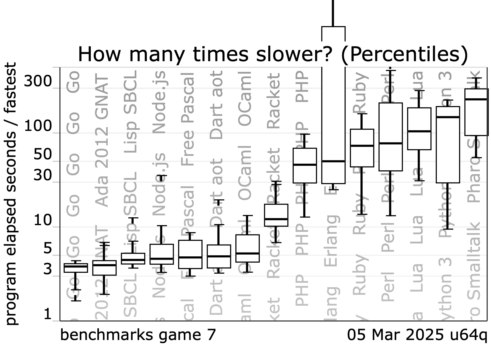

Basic Seminar Info
===

# Quick info

Zed, RustRover, and rustup should be pre-installed on images in Windows and Linux computer rooms.

# Topics

| Topic                                                               | Date (exceptions) |
|---------------------------------------------------------------------|-------------------|
| 1.  Introduction to Rust - tooling, basic syntax, modules and test  | 30. 09            |
| 2.  Type system, ownership, borrowing                               | 6.10. TUESDAY     |
| 3.  Control flow and error handling                                 | 14.10.            |
| 4.  Closures, collections, iterators                                | 21.10.            |
| 5.  Smart pointers and interior mutability                          | 27.10 TUESDAY     |
| 6.  Concurrency and parallelism                                     | 4.11              |
| 7.  Asynchronous programming - basics                               | 11.11             |
| 8.  Asynchronous programming - project using a simple reverse proxy | 18.11.            |
| 9.  Macros                                                          | 25.11             |
| 10. Unsafe, FFI and interop with C/C++                              | 2.12.             |

# ICS

<!-- speaker_note: this is a speaker note -->

Assignemonts
===

| Homework                                                                            | Notes                                |
|-------------------------------------------------------------------------------------|--------------------------------------|
| 1. Create a simple calculator (+,-,*,/,^,log)                                       | i32 only, div/0 mustn't panic        |
| 2. Make a serializable struct for JSON                                              |                                      |
| 2. Find the longest substring and return reference                                  |                                      |
| 3. Add error handling to the calculator                                             |                                      |
| 3. Get a trams/stops from Golemio API and print nearest departures of selected stop | https://api.golemio.cz/docs/openapi/ |
| 4. TBD                                                                              |                                      |
| 5. TBD                                                                              |                                      |
| 6. TBD                                                                              |                                      |
| 7. TBD                                                                              |                                      |
| 8. TBD                                                                              |                                      |
| 9. TBD                                                                              |                                      |
| 10.  TBD                                                                            |                                      |

Literature and Courses
===

| Book/Course                                                                                              | Notes                                                              |
|----------------------------------------------------------------------------------------------------------|--------------------------------------------------------------------|
| [Programming Rust 3rd Edition](https://www.oreilly.com/library/view/programming-rust-3rd/9781098176228/) | Goes through everything in detail                                  |
| [Rust Locks and Atomics](https://mara.nl/atomics/)                                                       | Deep dive into internals of async/parallel                         |
| [The Rust Programming Language](https://doc.rust-lang.org/book/title-page.html)                          |                                                                    |
| [Write Powerful Rust Macros](https://www.manning.com/books/write-powerful-rust-macros)                   | Expert-level topics                                                |
| [Rust for Rustaceans](https://rust-for-rustaceans.com)                                                   | Intermediate book                                                  |
| [Rustlings](https://rustlings.rust-lang.org)                                                             | Built into RustRover                                               |
| [Crust of Rust](https://www.youtube.com/playlist?list=PLqbS7AVVErFiWDOAVrPt7aYmnuuOLYvOa)                | In-depth channel                                                   |
| [Exercism Rust](https://exercism.org/tracks/rust)                                                        | Nonprofit - mostly leetcode tasks                                  |
| [Codecrafters](https://app.codecrafters.io/catalog)                                                      | Paid but with a rotating free challenge monthly, advanced projects |
| [Rust Reference](https://doc.rust-lang.org/reference/)                                                   |                                                                    |
| [Docs](https://docs.rs)                                                                                  |                                                                    |

Seminar_01 – About Rust
===
<!-- column_layout: [1, 1] -->
<!-- column: 0 -->
[Rust Official Website](https://rust-lang.org)

# What is Rust

- The [most loved](https://survey.stackoverflow.co/2025/technology#admired-and-desired) general-purpose programming
  language
- Initially designed for system programming
    - nowadays used also for web apps, games, etc.
- Compiled, statically typed, strongly typed, language.
- Utilizes RAII
- Memory safe
    - compile-time checking of memory issues
- Multi-paradigm language
    - procedural
    - functional (strongly inspired by functional languages)
    - object-based (no inheritance, but has subtyping)
- It's *really* fast
    - has a minimal runtime
    - no garbage collection
    - ~zero-cost abstractions

<!-- column: 1 -->

Next Slide
===

Installation of Rust
===

IDEs and Editors
===

Next Slide
===

Bonus: How to open this presentation :)
===
Next Slide
===
Next Slide
===
