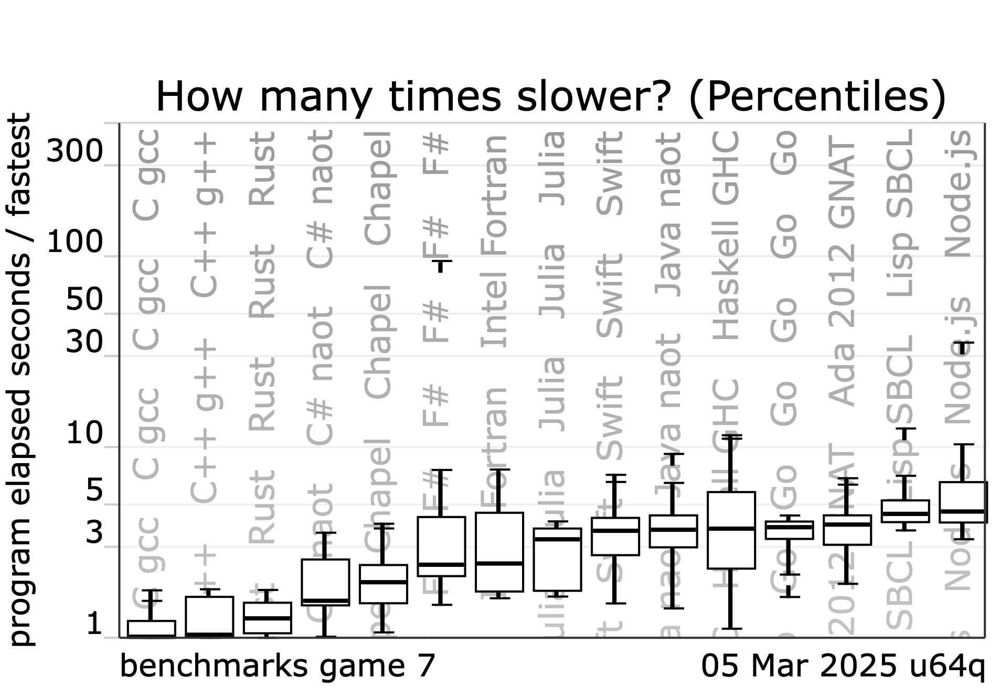
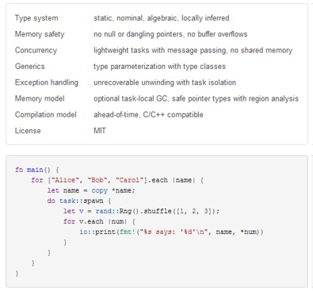

Something About Us
===
<!-- column_layout: [1, 1] -->
<!-- column: 0 -->

# Matej

Software Engineer, Senior - TBD

## Free Time & Interests

- LEGO

<!-- pause -->

<!-- column: 1 -->

# David

Software Engineer, Senior

## Worked at:

- Deloitte (IT Audit)
- CGI (design of navigation algorithms)
- Wooting (firmware, apps (in Rust!), frontend)
- Správa Železnic, s. o. (frontend developer)
- Rockwell Automation, s. r. o. (Rust engineer)

## Free Time & Interests

- Trying to contribute to the Rust project (clippy, bors, triagebot)
- Gaming (indie games, immersive sims, FPS, MOBAs)
- Exploring random tools (nushell)
- Buying useless tech and keyboards
- 

## Contact

- @medzernik - Discord, Signal, Telegram, Steam, GitHub, SourceHut ...
- [LinkedIn](https://www.linkedin.com/in/david-manca/)

Basic Seminar Info
===

<!-- column_layout: [2, 1] -->
<!-- column: 0 -->

# Topics

| Topic                                                      | Date (exceptions) |
|------------------------------------------------------------|-------------------|
| 1.  Introduction to Rust - tooling, syntax, modules & test | 30. 09            |
| 2.  Type system, ownership, borrowing                      | 6.10. TUESDAY     |
| 3.  Control flow and error handling                        | 14.10.            |
| 4.  Closures, collections, iterators                       | 21.10.            |
| 5.  Smart pointers and interior mutability                 | 27.10 TUESDAY     |
| 6.  Concurrency and parallelism                            | 4.11              |
| 7.  Asynchronous programming - basics                      | 11.11             |
| 8.  Asynchronous programming - simple reverse proxy        | 18.11.            |
| 9.  Macros                                                 | 25.11             |
| 10. Unsafe, FFI and interop with C/C++                     | 2.12.             |

> [!TIP]
> Zed, RustRover, and rustup should be pre-installed on images in Windows and Linux computer rooms.

<!-- column: 1 -->
# ICS


Assignments
===

1. Test module – the `/test` dir - some exercises to help practice concepts
2. Homework assigment - the `/src` dir
3. Code review – all assignments should have a code review by someone else in the course
4. Group projects – final, bigger project

| Homework                                                                            | Notes                                |
|-------------------------------------------------------------------------------------|--------------------------------------|
| 1. Create a simple calculator (+,-,*,/,^,log)                                       | i32 only, div/0 mustn't panic        |
| 2. Make a serializable struct for JSON                                              |                                      |
| 2. Find the longest substring and return reference                                  |                                      |
| 3. Add error handling to the calculator                                             |                                      |
| 3. Get a trams/stops from Golemio API and print nearest departures of selected stop | https://api.golemio.cz/docs/openapi/ |
| 4. TBD                                                                              |                                      |
| 5. TBD                                                                              |                                      |
| 6. TBD                                                                              |                                      |
| 7. TBD                                                                              |                                      |
| 8. TBD                                                                              |                                      |
| 9. TBD                                                                              |                                      |
| 10.  TBD                                                                            |                                      |

Literature and Courses
===

| Book/Course                                                                                              | Notes                                                              |
|----------------------------------------------------------------------------------------------------------|--------------------------------------------------------------------|
| [Programming Rust 3rd Edition](https://www.oreilly.com/library/view/programming-rust-3rd/9781098176228/) | Goes through everything in detail                                  |
| [Rust Locks and Atomics](https://mara.nl/atomics/)                                                       | Deep dive into internals of async/parallel                         |
| [The Rust Programming Language](https://doc.rust-lang.org/book/title-page.html)                          |                                                                    |
| [Write Powerful Rust Macros](https://www.manning.com/books/write-powerful-rust-macros)                   | Expert-level topics                                                |
| [Rust for Rustaceans](https://rust-for-rustaceans.com)                                                   | Intermediate book                                                  |
| [Rustlings](https://rustlings.rust-lang.org)                                                             | Built into RustRover                                               |
| [Crust of Rust](https://www.youtube.com/playlist?list=PLqbS7AVVErFiWDOAVrPt7aYmnuuOLYvOa)                | In-depth channel                                                   |
| [Exercism Rust](https://exercism.org/tracks/rust)                                                        | Nonprofit - mostly leetcode tasks                                  |
| [Codecrafters](https://app.codecrafters.io/catalog)                                                      | Paid but with a rotating free challenge monthly, advanced projects |
| [Rust Reference](https://doc.rust-lang.org/reference/)                                                   |                                                                    |
| [Docs](https://docs.rs)                                                                                  |                                                                    |

Seminar_01 – About Rust
===
<!-- column_layout: [1, 2] -->
<!-- column: 0 -->
[Rust Official Website](https://rust-lang.org)

# What’s Rust

- The [most loved](https://survey.stackoverflow.co/2025/technology#admired-and-desired) general-purpose programming
  language.
- LLVM-backed language.
- Initially designed for system programming
    - nowadays used also for web apps, games, etc.
- Compiled, statically typed, strongly typed, language.
- Utilizes RAII
- Memory safe
    - compile-time checking of memory issues
- Multi-paradigm language
    - procedural
    - functional (strongly inspired by functional languages)
    - object-based (no inheritance, but has subtyping)
- It's *really* fast
    - has a minimal runtime
    - no garbage collection
    - ~zero-cost abstractions
- Great backwards compatibility
- Fantastic compiler error messages

<!-- column: 1 -->
<!-- alignment: right -->
[](https://benchmarksgame-team.pages.debian.net/benchmarksgame/box-plot-summary-charts.html)




Where is Rust Used?
===

<!-- column_layout: [1, 1] -->
<!-- column: 0 -->

# Companies & Projects using Rust

- Microsoft
- Discord
- Mozilla
- Google (Android)
- Linux
- Toyota
- Dropbox
- Atlassian
- 1Password
- Cloudflare
- JetBrains
- Figma
- AWS
- [Linux!](https://www.youtube.com/watch?v=YyRVOGxRKLg)

<!-- pause -->

# Cool Software in Rust

| Name           | Note                                        |
|----------------|---------------------------------------------|
| helix          | TUI editor                                  |
| zed            | GUI editor                                  |
| presenterm     | Presentation tool (this one!)               |
| typst          | LaTeX alternative                           |
| ripgrep        | Very fast reimplementation of Grep          |
| rust-coreutils | reimpl of GNU coreutils (default in Ubuntu) |
| nushell        | a shell reimagined                          |
| fish           | semi-bash-compatible shell                  |
| ruff           | Python linter & formatter                   |

<!-- column: 1 -->

# Current Adoption Numbers

<!-- alignment: right -->
[](https://devecosystem-2025.jetbrains.com/tools-and-trends)


History
===
<!-- column_layout: [1, 1] -->
<!-- column: 0 -->

# 2006

- Created in Mozilla by *Graydon Hoare*

> "I think I named it after fungi… that is "over-engineered for survival."
> *\- Graydon Hoare*

<!-- pause -->

# 2010 - 2015

- Project Servo
- Early experiments
- Originally had GC, was class-based
- `0.11.0` caused some changes that may explain today's syntax
    - ~[T] has been removed from the language. This type is superseded by the Vec type.
    - ~str has been removed from the language. This type is superseded by the String type.
    - ~T has been removed from the language. This type is superseded by the Box type.
    - @T has been removed from the language. This type is superseded by the standard library’s std::gc::Gc type.
- [Rust testcases over time](https://brson.github.io/archaea/)
- [A look from 2012](https://purplesyringa.moe/blog/a-look-at-rust-from-2012/)
- [Evolution of compiler errors](https://kobzol.github.io/rust/rustc/2025/05/16/evolution-of-rustc-errors.html)

> Rust is a curly-brace, block-structured expression language that looks similar to C and C++ and allows developers to
> write code that behaves well in large and concurrent systems.
> [](https://www.i-programmer.info/news/98/6074.html)


<!-- column: 1 -->


> Someone recently quipped that if you can hang yourself with one pointer then three distinct types should do the job in
> far less time
> *[](https://www.i-programmer.info/news/98-languages/5042-rust-04-full-integration-of-borrowed-pointers.html)*

<!-- pause -->

# 2015

- Rust 1.0
- Rust group was dissolved
- Formation of the Rust Foundation (Google, Microsoft, AWS, Huawei, Mozilla)

<!-- pause -->

# 2016 - now 
- [MIR](https://blog.rust-lang.org/2016/04/19/MIR/)
- New editions released
- Clippy, MIRI, etc.
- Support for new architectures

Rust Versioning
===

# Versioning

Rust is released every 6 weeks.

- stable
- beta
- nightly

Installation is done using a separate tooling script `rustup`. We’ll look at this a little later.

<!-- pause -->

## Compiler versions vs. Editions

Aside from the regular releases, Rust also releases `Editions`. There’s usually an edition released every 3 years.
Currently, there are `2015`, `2018`, `2021` and `2024` editions of Rust available.

Editions introduce breaking changes into the language.

This is possible to keep separate from the compiler updates due to the design of the compiler and
language, [as seen here](https://blog.rust-lang.org/2018/07/27/what-is-rust-2018/#managing-compatibility)

Most importantly:
> Anything that doesn’t require being a part of Rust 2018 will work on Rust 2015 as well. This is due to the way
> editions work; given the small nature of possible changes, the compiler uses the same internal representation for all
> editions.

It’s a standard practice to keep your Rust toolchain updated to the latest `stable` version, even in production.

Installing Rust I.
===

# Installing the Linker

> [!IMPORTANT]
> Rust doesn’t have a linker. This means you have to install a linker yourself.

<!-- pause -->

## Windows - Installing the linker

If we’re on MS Windows, we’ll need to first install the `MS Build Tools`, available also from
the [link here](https://aka.ms/vs/stable/vs_BuildTools.exe)

After installing the Build Tools, we need to make sure we select the entire C/C++ compiler group, and also using the
`Individual Packages` UI insert the `platform latest spectre` search term, then pick the resulting spectre safe
libraries

<!-- pause -->

> [!TIP]
> Rust takes a long time to compile. To make this about 1/3rd faster on Windows, you can set up a **Dev Drive**.
> Follow the instructions [on the Microsoft page](https://learn.microsoft.com/en-us/windows/dev-drive/) if you wish to
do so. Note that you need to make a separate partition of a minimum 50GB. You can shrink an existing NTFS partition
while it's online. The **DevDrive** partition will use ReFS and Windows Defender will work in a deferred async scan mode
to make compilation a lot faster.

<!-- pause -->

## Linux

Install the `build-essentials` package on Ubuntu/Debian/Mint (or your distribution equivalent).

<!-- pause -->

## macOS

Install the xcode-command line build tools

Installing Rust II.
===

# Installing Rust

After we install the linker, we can download the `rustup` installer `.exe` and use it to setup the toolchain. `rustup`
will serve as our Rust package manager

We can find `rustup` on the webpage [rustup.rs](https://rustup.rs)
or [rust-lang.org](https://rust-lang.org/tools/install/)

<!-- pause -->

That's it! You can open up a new terminal window after it's installed and try to run

```shell +exec 
cargo --version
```

We’ll look into Cargo a little later.

> [!TIP] Rust Playground
> You can use the [Rust Playground](https://play.rust-lang.org) to test out your Rust snippets, share them and even run
> Miri and expand macros!

Build system - Cargo
===

- An amazing build system
- Integrated documentation builder
- Integrated dependency resolution
- Uses a central registry [crates.io](https://crates.io)
    - can use other, private registries as well
- Uses `.lock` files to pin dependencies

IDEs and Editors I.
===

There are many great editors to choose from. Rust has a fantastic LSP `rust-analyzer` that should integrate within
almost any editor. Our recommendations are `Zed`, `Helix` or `RustRover`.

# Zed

Zed offers collaborative features and fast performance. It’s a multi-language editor, focused on speed. It has an
**integrated debugger**, **terminal**, **basic git support**. It has advanced **remote development features**, including
support for `WSL2` and SSH into other machines. Zed also has a great `Helix` and `Vim` modes.

You can get Zed on the page [zed.dev](https://zed.dev)

<!-- pause -->

# Helix

Helix is a terminal editor, similair to `NeoVim` that has a focus on speed and uses `Kakoune` inspired keybinds. It’s
significantly easier to learn than `Vim`, but the motions aren’t transferable easily.

Helix is available ideally using either `WinGet` on Windows, or `brew install helix` on macOS and Linux. Distribution
repos may have an outdated version of Helix.
> [!NOTE]
> Helix has an incomplete debugger protocol (DAP) support. Debugging may be complicated but should be possible.

> [!IMPORTANT]
> When using **NeoVim**, **Helix** or other more obscure editors, you need to install **rust-analyzer** yourself.
> You can do so by running the command:
> **$ rustup component add rust-analyzer**
> The reason for this is that **Zed** and **VSCode** all automatically pull in the LSP separately from the toolchain
> when launched.

IDEs and Editors II.
===

# RustRover

RustRover is a fully fledged IDE, available for free for non-commercial use, and also available for free for students.

> [!NOTE]
> RustRover uses its own parsing engine and custom-built analysis. You can learn
more [in this YouTube video](https://youtu.be/VbdD1c3owKc)

Compared to `rust-analyzer`, RustRover analysis engine can help with:

- Cargo.toml file support
- Cargo command runner
- advanced Rust debugger including support for embedded targets and remote debugging
- declarative macro tester
- built-in procedural macro expansion
- Rust REPL frontend
- actix/reqwest web framework endpoint support
- Cargo test support including highligts of lines where tests failed
- database client
- lifetime highlighting
- full-featured Git/subversion/other VCS clients
- advanced refactoring
- unsafe blocks highlighting
- and much more :D

Cargo
===

<!-- column_layout: [1, 1] -->
<!-- column: 0 -->
Maybe even better than Rust. Allows you to manage your Rust projects.

<!-- pause -->

# Creating a project

$ cargo new \<name>

$ cargo init \<name>

<!-- pause -->

# Managing dependencies

$ cargo add \<dep>

$ cargo remove \<dep>

$ cargo update

$ cargo install \<dep>

<!-- pause -->

# Formatting, checking and building the project

$ cargo fmt

$ cargo check

$ cargo clippy

$ cargo run

$ cargo build

$ cargo test

$ cargo doc
<!-- column: 1 -->

<!-- pause -->

> [!TIP] clippy
> Clippy is the official Rust linter. It can check for various patterns that aren’t considered best practice. We use
> Clippy regulary as a CI tool in 'warnings as errors' mode in production

> [!TIP] fmt
> Rust has a formatter tool that formats the code in a standardized way. Use this tool each time you publish your
> solution anywhere, as usually it's part of CIs

> [!TIP] automating running of tasks
> To automate all generic tasks, we recommend the tool [bacon](https://dystroy.org/bacon/). It allows you to easily run
> check, build and test tools. You can also use RustRover's built in toolset, or automate using Tasks in **Zed** or
> VSCode.

> [!TIP] doc
> Rust also has an integrated documentation tool. You can see the documentation formatted using this tool almost
> everywhere online.

Basic Syntax
===

Rust has a simple Hello World! example:

```rust +exec
fn main() {
    println!("Hello, world!");
}
```

<!-- pause -->


Taking the example apart
===

<!-- column_layout: [1, 1] -->
<!-- column: 0 -->

# Example `main()` Function


```rust 
fn main() {
    println!("Hello, world!");
}
```

## What did you notice?
<!-- incremental_lists: true -->

- No `return 0`.
- Functions are declared via `fn` and not via return types.
    - this simplifies the parsing of the source code and visual parsing as well.
- Statements end with a `;`.
    - Note that `;` has a special meaning in Rust and changes the semantics of your code.
- The entrypoint to the application must be named `main`

<!-- pause -->

# println!()

`println!()` is a macro.

```rust 
println!("Hello, world");
```
<!-- pause -->
<!-- column: 1 -->

This macro is defined as:

```rust
macro_rules! println {
    () => { ... };
    ($($arg:tt)*) => { ... };
}
```

<!-- pause -->
... and expands to:

```
::std::io::_print(format_args!("Hello, world!\n"));
```

<!-- pause -->
> [!TIP] Expanding Macros
> You can expand macros using the '$ cargo expand' tool, which you can install using '$ cargo install cargo-expand'

<!-- pause -->
> [!IMPORTANT] Why a macro?
> Rust doesn’t support the `...` syntax for variadic arguments.
> The only way to make a function with variable argument input is by using a macro.

<!-- pause -->
> [!NOTE] Expert-level Topic
> Macros are an expert-level topic that we’ll take a look at near the end of the seminars.
> Don't worry - using macros is very easy and fun. Writing them is hell.

Declaring Variables
===

# Rules

<!-- incremental_lists: true -->

1. All declarations are immutable by default.
2. All let blocks need to end with a `;`.
3. You can shadow existing declarations.
4. Declarations are dropped at the end of their respective scope.
5. All variables must be initialized to a value.

# Keywords

`let <mut> <name>:<type> = <expression>`

<!-- pause -->

> [!TIP] Keywords in Declarations
> Rust puts the **fn** and **let** keywords first, you declare the type later. This applies also to function arguments.

<!-- pause -->

# Binding

```rust {2|3|4|5|6|7} +no_background
fn main() {
    let x;            // declare a variable with no type (autoinfer later)
    let x = 5;        // declare a variable x with value 5 (autoinfer i32)
    let mut y = 5;    // declare a variable mutable (autoinfer i32)
    let z: i32 = 5;   // manually specify the type (expression must be of i32)
    let a = 5i64;     // manually modify the expression type value (autoinfer i64)
    let a = 5 as i64; // manually modify the expression type value (autoinfer i64)
}
```

> [!IMPORTANT] Automatic Inference
> Rust automatically infers the data type.

<!-- pause -->

> [!TIP] LSP Inlay Hints
> Your LSP will show an inlay hint (sometimes hidden by default) of each type.

> [!IMPORTANT]
> Rust is a strongly typed language. Even though you don't see the types in the examples, they’re enforced.


Shadowing I.
===

Shadowing allows us to redefine an existing binding.

```rust +exec {2,4}
fn main() {
    let x = 5;
    println!("{x}");
    let x = 10;
    println!("{x}");
}
```

Shadowing II.
===

```rust +exec {2,4}
fn main() {
    let x = 5;
    println!("{x}");
    let x = "hello";
    println!("{x}");
}

```

<!-- pause -->

> [!IMPORTANT] Question
> - Can we get back to the original binding?
<!-- pause -->
> [!IMPORTANT] Answer
> NO!


Primitive Types
===
Rust has a fairly rich primitive type system.

| Type                    | Example            | Note                                                |
|-------------------------|--------------------|-----------------------------------------------------|
| u8, u16, u32, i64, u128 | 5, 10              |                                                     |
| i8, i16, i32, u64, i128 | -5, 10             |                                                     |
| isize, usize            | -67, 23            | pointer size (CPU arch size)                        |
| f32, f64                | 67.56, -23.09      |                                                     |
| str                     | "hello", "😭 sad"  | UTF-8 - we can't index easily, auto-null terminated |
| char                    | '🫡'               | UTF-8 rune                                          |
| bool                    | true, false        |                                                     |
| []                      | [2,3,4,5]          | fixed-size array                                    |
| &[1..=2]                | &[3,4]             | slice into existing array                           |
| (x, y)                  | (true, 32)         | tuple - multiple types grouped together             |
| fn                      | fn(x: u32) -> bool | function                                            |

Basic Control Flow I.
===

The most basic control flows: `if` and `for`.

# `if` + `else`

```
if condition {
    something;
} else {
    something_else;
    and_yet_another_something;
}
```

<!-- pause -->

> [!TIP] Why no `()`?
> Rust, Go and some other languages have started requiring you to put `{}`. This frees up the lexer requirement for the
> `()`. Rust therefore doesn't require you to put `()`, but requires `{}` everywhere. This is done for 2 reasons:
> \-------
> 1. Makes the `if` statement compose nicely in `let` chains (advanced technique, later)
> 2. Prevents bugs like the famous [goto fail](https://www.imperialviolet.org/2014/02/22/applebug.html)
> \-------
> In other words: languages like C force you to always put `()` but don't require `{}`
> Rust always forces you to put `{}` but doesn't require `()`.

<!-- pause -->

> [!Important]
> There are no ternary operators in Rust.


Basic Control Flow I. – If, Else.
===

# Example

Simple example to check whether a number is even or odd

```rust +exec +line_numbers {2-3| 5-7 |2-8}
fn main() {
    let x = 6;
    let mut is_even = false;

    if x % 2 == 0 {
        is_even = true;
    }
    println!("{x} is even: {is_even}");
}
```

Basic Control Flow II. – Loops
===

Using the `while` `loop` and `for` keywords, you can create loops.

Their associated `continue` and `break <label>` keywords help control the flow.
Use `'LABEL:` to create a break label to jump to.

# Loop
`loop` loops forever, until broken by a `break`.

```rust +exec +line_numbers {4-8}
fn main() {
    let mut x = 0;
    
    loop {
        x += 1;
        if x >= 5 {
            break;
        }
    }
    println!("{x}");
}
```

<!-- pause -->


> [!Important] No `goto`
> Rust has no **goto**. Labels only exist for jumps using the **break** keyword.

<!-- pause -->

> [!Important] No `++` and `--`
> Rust has no postfix or prefix increments or decrements. You must use **+=**.

Basic Control Flow II. – Loops
===

# While

`while` loops until the condition isn’t met:

<!-- pause -->

```rust +exec +line_numbers {3-5}
fn main() {
    let mut x = 0;
    while x < 5 {
        x += 1;
    }
    println!("while loop finished: {x}!");
}
```

> [!TIP]
> Just as with **if**, you don't use any **()** in the condition.

Basic Control Flow II. - Loops
===

# For
`for` loop is the most versatile loop type.

It uses **iterators**. We’ll take a look at iterators in a later stage of the course.

We will create an **iterator** over a range of values. The keyword `in` creates a value

<!-- pause -->

## C
```c 
for (int i; i < 5; ++i) {
    printf("%d", i);
}
```

<!-- pause -->

## Rust
```rust +exec
fn main() {
    for i in 0..=10 {
        print!("{i} ");
    }
}
```


Error Messages
===

```rust +exec
fn main() {
    let x = 5;
    x = 10;
    println!("{x}");
}
```

Workspaces & Project Structure
===

Homework
===


Bonus: How to open this presentation :)
===

Thanks!!!
===
